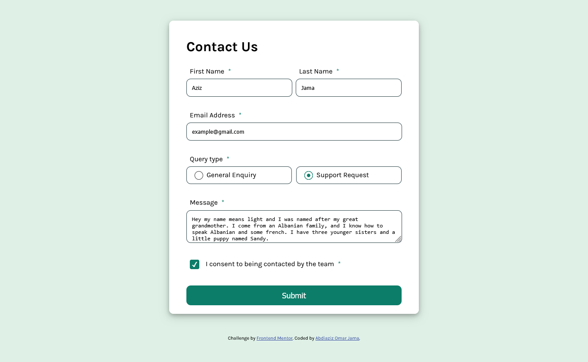
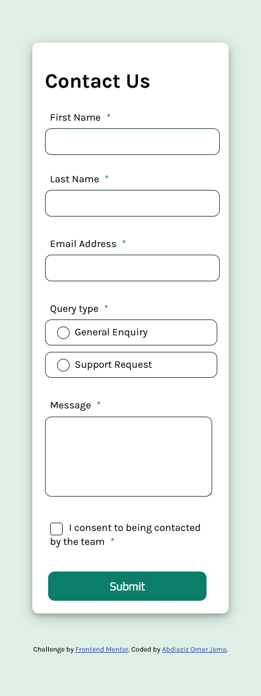

# Frontend Mentor - Contact form solution

This is a solution to the [Contact form challenge on Frontend Mentor](https://www.frontendmentor.io/challenges/contact-form--G-hYlqKJj). Frontend Mentor challenges help you improve your coding skills by building realistic projects. 

## Table of contents

- [Overview](#overview)
  - [The challenge](#the-challenge)
  - [Screenshot](#screenshot)
  - [Links](#links)
- [My process](#my-process)
  - [Built with](#built-with)
  - [What I learned](#what-i-learned)
  - [Continued development](#continued-development)
  - [Useful resources](#useful-resources)
- [Author](#author)
- [Acknowledgments](#acknowledgments)


## Overview

### The challenge

Users should be able to:

- Complete the form and see a success toast message upon successful submission
- Receive form validation messages if:
  - A required field has been missed
  - The email address is not formatted correctly
- Complete the form only using their keyboard
- Have inputs, error messages, and the success message announced on their screen reader
- View the optimal layout for the interface depending on their device's screen size
- See hover and focus states for all interactive elements on the page

### Screenshot


DesktopView States:




MobileView:



### Links

- Solution URL: [Add solution URL here](https://your-solution-url.com)
- Live Site URL: [Add live site URL here](https://your-live-site-url.com)

## My process

### Built with

- Semantic HTML5 markup
- CSS custom properties
- Flexbox
- Sass
- Mobile-first workflow
- git , github
- DOM -javaScript


### What I learned

This challenge was quite interesting! I really enjoyed figuring out and working on this contact form challenge. I learned a lot of features, including form validation and styling, to achieve the final goal. It was an amazing challenge, and now I am proud of myself for reaching a satisfying design outcome.

One of the struggles I had was figuring out how to achieve the radio button design. So, I researched it until I got it to work. Here’s how you can do the same! 

The following CSS code customizes the appearance of radio buttons by styling the label::before pseudo-element.


```css
input[type="radio"] + label::before {
    content: "";
    display: inline-block;
    width: 20px;
    height: 20px;
    border: 1px solid #333;
    border-radius: 50%; /* Make it circular */
    background-color: white;
    margin-right: 8px;
    vertical-align: middle;
    transition: background 0.3s, border 0.3s, box-shadow 0.3s;
}

/* When the radio button is checked */
input[type="radio"]:checked + label::before {
    background-color: hsl(169, 82%, 27%);
    border-color: hsl(169, 82%, 27%);
    box-shadow: inset 0 0 0 5px white; /* Inner circle effect */
}

```

### Explanation

- The ::before pseudo-element is used to create a custom radio button.
- It is styled as a circular shape (border-radius: 50%) and positioned before the label.
- When the radio button is checked, the background color changes, and an inner circle effect is created using box-shadow.
- Smooth transitions enhance the UI experience.

### Continued development

- Advanced Form Styling – Enhancing the appearance of form elements for a more polished and user-friendly design.
- JavaScript Form Validation – Strengthening my skills in client-side validation to improve user experience and data accuracy.
- CSS Animations & Transitions – Refining smooth effects to make UI interactions more engaging.
- Accessibility & UX Best Practices – Ensuring that forms and other UI components are accessible to all users.
- Optimizing for Performance – Learning better ways to write efficient and maintainable code.


### Useful resources

- [CSS radio button](https://dev.to/gscode/10-radio-button-css-style-examples-ph6) - This helped me for styling radio button. I really liked this pattern and will use it going forward.


## Author

- Website - [Aziz-portfolio](https://0paziz.github.io/Aziz-portfolio/index.html)
- Frontend Mentor - [@0paziz](https://www.frontendmentor.io/profile/@0paziz)
- Twitter - [@0paziz](https://www.twitter.com/@0paziz)


## Acknowledgments

I would like to express my gratitude to everyone who contributed to my learning and progress on this project.

- Online Resources & Documentation: Platforms like MDN Web Docs, React Docs, and CSS-Tricks helped me better understand key concepts.

- Community Support: Thanks to the developer community on Stack Overflow and GitHub discussions for insightful solutions and troubleshooting tips.

- Inspiration from Other Projects: Looking at various frontend projects and design inspirations helped me refine my approach to achieving the desired layout and responsiveness.

Their guidance and resources played a crucial role in overcoming challenges and improving the overall quality of my work. 

